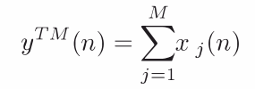
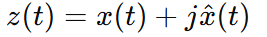
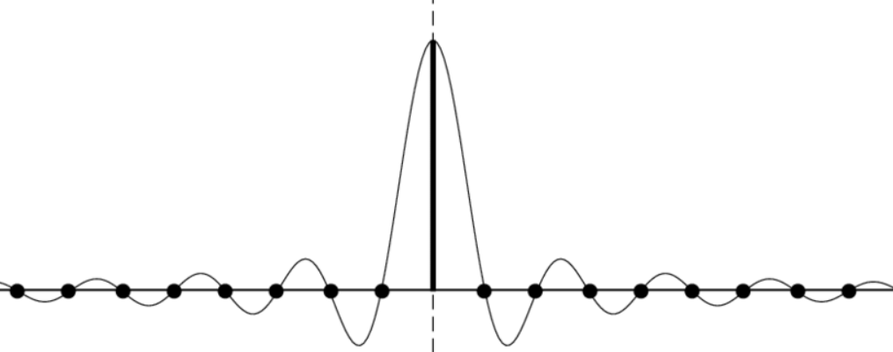
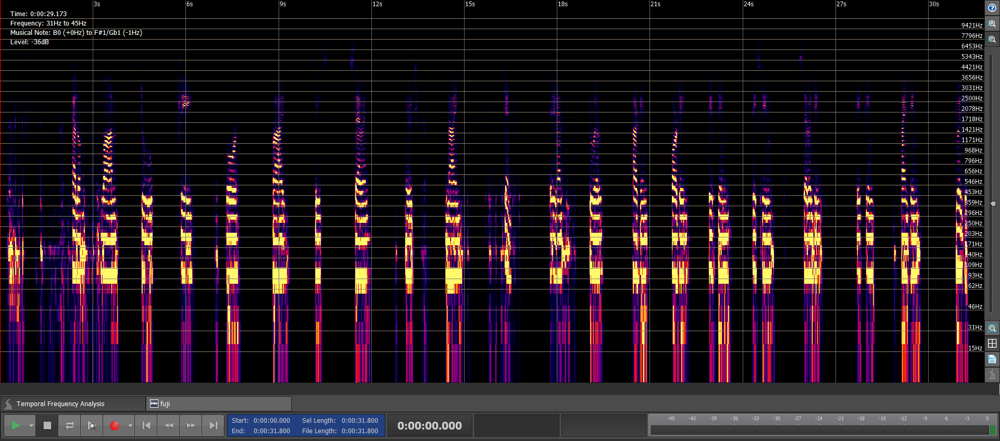
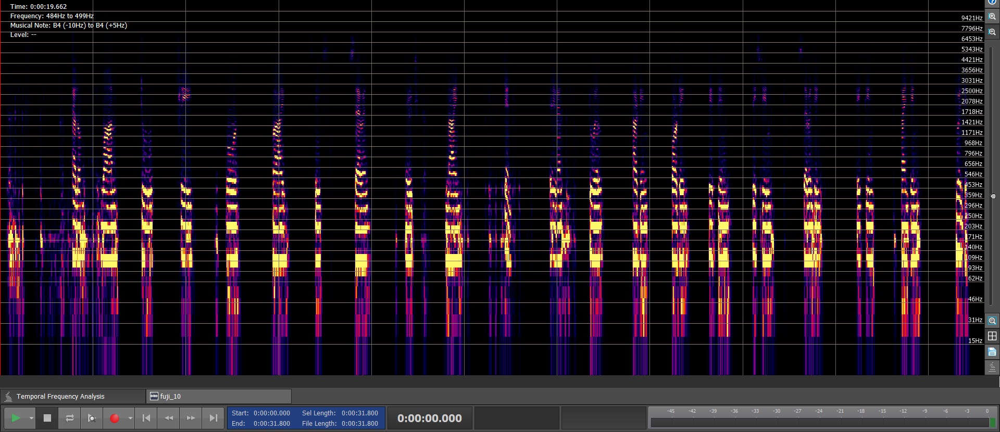

## Audio Mixing

In real-time audio conferencing when multiple participants speak simultaneously, their voices need to be mixed and played to the receiver. Thus the received voice file contains only voices from all participants except the receiver's voice. Efficient mixing of participant voices is crucial to ensure clarity, loudness as well as smoothness of voice level. There are many algorithms for mixing audio such as:
* Summation
* Align-to-Average weighted
* Align-to-Greatest weighted
* Align-to-Weakest weighted
* Align-to-Self weighted
* Algin-to-RMS weighted

Experimentations with different audio files reveal that Align-to-RMS weighted is the optimal choice for mixing audio when working with audio chunks of duration 60ms (960 samples).

## Align-to-RMS weighted algorithm
1. All the audios are summed to generate a true mixer output. The figure below shows the formula of a true mixer output.
<p align="center">
    
</p>

2. For every chunk of 960 samples the root mean square (RMS) value is calculated and stored.

3. Every audio chunk of 960 samples from each participant is collected and their RMS value is calculated and stored.

4. The ratio of RMS value from steps 3 and 2 is measured and multiplied by the true mixer output for the particular audio chunk. This generates the mixed audio.

The formula of the Align-to-RMS weighted audio mixing algorithm is provided below:

<div align="center">
    Y<sub>rms</sub> = Y<sub>true_mixer</sub> * (input<sub>rms</sub> / mixed<sub>rms</sub>)
</div>


## Pseudocode of True Mixer
    
```
def findMaxAudioLen(audios):
    maxLen = 0
    for audio in audios:
        maxLen = MAX(maxLen, LEN(audio))
    return maxLen

def trueMixer(audios):
    N = findMaxAudioLen(audios)
    M = LEN(audios)

    for i = 0 to N-1:
        sum = 0
        for j = 0 to M-1:
            sum += audios[j][i]

        mixer[i] = sum
    return mixer
```

## Pseudocode of calculating mixed<sub>rms</sub> and input<sub>rms</sub>

```
def findMixedRMS(mixer):
    N = LEN(mixer)
    for i = 0 to N-1:
        s += (mixer[i] * mixer[i])
    return SQRT(s / N)

def findInputRMS(audios):
    N = findMaxAudioLen(audios)
    M = LEN(audios)
    
    for i = 0 to N-1:
        s = 0
        for j = 0 to M-1:
            s += (audios[j][i] * audios[j][i])
        sumOfSqr[i] = s

    nominator = findMixedRMS(sumOfSqr)
    return nominator


```

## Pseudocode of Align-to-RMS weighted algorithm

```
def alignToRMS(audios):
    mixer = trueMixer(audios)
    nominator = findInputRMS(audios)
    denominator = findMixedRMS(mixer)

    N = LEN(mixer)
    N = 

```


-------------------------------

Audio signals are composed of sinusoids with different frequencies. In frequency shifting, the entire frequency spectrum of an audio signal is shifted upward or downward by a specified frequency shift amount. It is used in the Acoustic Feedback Loop Suppression problem. 

In the acoustic feedback loop, the sound that is played by the speaker is picked up by the microphone and reamplified again and again causing a loop. This feedback loop causes an annoying sound called howling. If it remains unhandled this howling sound can severely affect the voice quality. Frequency shifting disrupts the formation of this loop by shifting the frequencies up or down by a small amount.


## Frequency Shifting Process
1. At first the Hilbert Transformer is applied to the real-valued signal which creates a complex-valued analytical signal. The real part of the analytical signal contains the original signal and the imaginary part contains the Hilbert Transform of the original signal. The formula of the Hilbert Transform is provided below.

<p align="center">
    
</p>

**Hilbert Transformation**<br>
* At first Fast Fourier Transformation (FFT) is applied to the original signal.
* Only positive frequencies are kept. The real and imaginary parts of the positive frequencies are multiplied by 2.
* Negative frequencies are zeroed out.
* Then the inverse FFT is applied.
* The resulting signal is called the analytical signal.

2. The analytical signal is multiplied by **e^i(2 * PI * f<sub>s</sub> * (t / f))**<br>
   Here,<br>
   * ``i`` = imaginary unit.
   * ``PI`` = 3.14159
   * **f<sub>s</sub>** = frequency shift amount
   * ``t`` = time
   * ``f`` = frequency
3. The above multiplication resulted in the shifted frequency spectrum by f<sub>s</sub> amount.
4. The real part of this signal is the final shifted version in the time domain.

**Pseudocode of Hilbert Transformation**
```
def hilbertTransformation(audio):
    N = LEN(audio)
    audioFFT[] = FFT(audio)
    for i = 0 to N/2 - 1:
        audioFFT[i] *= 2

    for i = N/2 to N - 1:
        audioFFT[i] = 0

    analyticalSignal = IFFT(audioFFT)
    return analyticalSignal
    
```

**Observations**
* When applying the frequency shifting on an audio chunk of duration 60ms (``960 samples``), some artifacts are added in the frequency-shifted audio.
* For audio chunks of duration multiples of 100ms (``1600 samples``), frequency shifting does not introduce any artifacts.
* As we process audio chunks of 60ms, at first using Sinc interpolation we generate 1600 samples from 960 samples.
* Then frequency shifting is applied to this interpolated signal and finally, the resulting signal is downsampled to 960 samples.

## Sinc Filter
For resampling Sinc filter is used which has a maximum value of 1 at index 0 and decades gradually on both ends. The formula of the Sinc filter is provided below.

<p align="center">
    
</p>

The below figure shows the shape of the Sinc filter. 

<p align="center">
    
</p>

**Pseudocode for Sinc filter, Up and Down sampling**
```
def sinc(x):
    if x == 0:
        return 1
    return sin(PI * x) / (PI * x)


def sincUpSample(audio, targetSize):
    originalSize = LEN(audio)
    ratio = targetSize / originalSize

    for i = 0 to targetSize - 1:
        sum = 0
        position = i / ratio
        leftIndex = FLOOR(position)

        for j = leftIndex - 64 to leftIndex + 64:
            if j >= 0 and j < originalSize:
                sum += (audio[j] * sinc(position - j))
        upsample[i] = sum
    return upsample


def sincDownSample(upsample, originalSize):
    targetSize = LEN(upsample)
    ratio = targetSize / originalSize

    for i = 0 to originalSize - 1:
        sum = 0
        position = i * ratio
        leftIndex = FLOOR(position)

        for j = leftIndex - 64 to leftIndex + 64:
            if j >= 0 and j < targetSize:
                sum += (upsample[j] * sinc(position - j))
        audio[i] = sum
    return audio

```

## Pseudocode of Frequency Shifting
```
timer = 0

def frequencyShifting(audio):
    targetSize = 1600
    originalSize = LEN(audio)
    upsample = sincUpSample(audio, targetSize)
    analyticalSignal[] = hilbertTransformation(upsample)

    N = LEN(analyticalSignal)
    for i = 0 to N-1:
        analyticalSignal[i] *= (e ^ (2 * PI * fs * (timer / f))
        timer += 1

    audio = sincDownSample(upsample, originalSize)
    return audio

```
Note: For better audio quality the Dynamic Range Compression algorithm can be applied after applying frequency shifting.

## Simulation and Optimal Values of Parameters
We applied Frequency Shifting to the raw audio file sampled at 16000 Hz. Optimal values of parameters are provided below:
* f<sub>s</sub> = ``5``
* target<sub>chunk_size</sub> = ``1600``
* window<sub>size</sub>: ``129`` (-64 to +64)

## Real-time Example
With the optimal configuration, we applied the Frequency Shifting algorithm to the [input audio](audio/fs_input.raw) and generated the [output audio](audio/fs_output.raw). The images below visualize the input and output of audio signals in the frequency domain with a frequency shift amount of 10 Hz.

<p align="center">
    <br>
    <span>Fig: Input image</span>
</p>

<p align="center">
    <br>
    <span>Fig: Output image</span>
</p>

From these figures, it is evident that after applying the Frequency Shifting algorithm the frequencies are moved upward by 10 Hz.

## References
1. FREQUENCY SHIFTING FOR ACOUSTIC HOWLING SUPPRESSION (Paper - 2010)
      * https://ccrma.stanford.edu/~eberdahl/Papers/DAFx2010BerdahlHarris.pdf
      * https://ccrma.stanford.edu/~eberdahl/Projects/FreqShift/ (Demonstration - Stanford University)

2. 50 Years of Acoustic Feedback Control: State of the Art and Future Challenges (Paper - 2010)
      * https://ieeexplore.ieee.org/document/5675660 (Review paper on different methodologies for AFC)

---
**Prepared by**<br>
*Jakir Hasan (Reve Systems'24)*<br>
*Date (creation) - 31/10/24*<br>
*Date (last modification) - 31/10/24*<br>


**Supervised by**<br>
*Md. Maniruzzaman Monir*<br>
*Nafiul Alam Fuji*<br>


