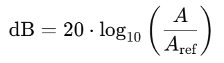

## Dynamic Range Compression (DRC)

In real-time audio or video conferencing, a sudden increase in the participant’s voice can degrade the perceptual audio quality. To maintain a consistent voice level during audio conferencing, it is necessary to attenuate the loud voices without causing additional artifacts. The Dynamic Range Compression algorithm accomplishes this goal by compressing the audio amplitudes where the decibel level exceeds a certain threshold. Amplitudes below this threshold are left unchanged which ensures a smooth transition of voice level. <br>

In ``DRC`` the following algorithm is used for compressing the high amplitudes of audio.

<p align="center">
    
</p>

Here, 
* **x<sub>G</sub>** indicates the decibel value corresponding to the audio sample.
  
* ``T`` indicates the threshold in the decibel full-scale (dbFS) unit. In digital audio systems, the highest dbFS value is 0 and all other values are negative. For example, -10 dbFS indicates that the decibel value is 10 units lower than the highest dbFS level (0 dbFS).
  
* ``R`` indicates the ratio (``R:1``) for performing the compression. For example, if the compression ratio is ``2:1``, then for every 2-decibel increase from the threshold value the output will be only 1-decibel increase from the threshold. Let's say that the threshold value is set to -10 dbFS, and the amplitude of an audio sample corresponds to -8 dbFS which is a 2-decibel increase from the threshold (``-8 - (-10) = 2``). So, as the ratio of compression is 2:1, the output will be increased by 1 decibel from the threshold (``-10 + 1 = -9``). In this way, all the audio samples will be compressed where decibel values exceed the thresholds resulting in a smooth transition of voice level.

* **y<sub>G</sub>** contains the decibel value corresponding to the compressed audio sample when the criteria of compression are met otherwise the decibel value remains unchanged.

## Amplitude to Decibel and Decibel to Amplitude 

In our case, we are working with raw audio with the following properties:

<div align="center">
    
| Property | Value | 
|:----------:|:----------:|
| Sample Rate (Hz) | 16000 | 
| Sample Size (in bits) | 16  | 
| Signed | True | 
| Big Endian | False |

</div>

As we are working with ``16-bit`` signed numbers, the highest number we can represent is ``32786``. For measuring decibel full-scale value (dbFS) from the amplitudes, they must be normalized by this upper limit. The formula for measuring the decibel full-scale value from the amplitude value of an audio sample is provided below.

<p align="center">
    
</p>

Here, 
* ``A`` indicates the amplitude value of an audio sample.
* **A<sub>ref</sub>** is the highest amplitude value (32768).
* ``dB`` is the decibel full-scale value.

After converting the amplitude value to dbFS unit the DRC algorithm performs the compression and the resulting dbFS value is converted to the amplitude value. The formula for converting dbFS value to the amplitude value is provided below.

<p align="center">
    
</p>

## Simulation and Optimal Values of Parameters
We have applied the DRC algorithm to raw audio with the previously specified audio format. Experimental results with different parameter values reveal that the configuration provided below is the most optimal choice.

* Threshold (T): ``-15 dbFS``
* Ratio (R): ``2``

## Pseudocode

```
def amplitudeTodB(amplitude):
    return (20 * log10(ABS(amplitude) / 32768.0))

def dBToAmplitude(db):
    return (32767 * 10^(db / 20))

def dynamicRangeCompression(audio):
    threshold = -15
    ratio = 2
    N = LEN(audio)

    for i = 0 to N-1:
        amplitude = audio[i]
        if amplitude == 0:
            continue
        db = amplitudeTodB(amplitude)
        if db > threshold:
            audio[i] = SIGN(amplitude) * dBToAmplitude(db)
```

## Real-time Example
With the optimal configuration, we applied the DRC algorithm to the [input audio](audio/drc_input.raw) and generated the [output audio](audio/drc_output.raw). The below images visualize the input and output audio signals.

<p align="center">
    <br>
    <span>Fig: Input image</span>
</p>

<p align="center">
    <br>
    <span>Fig: Output image</span>
</p>

From these figures, it is evident that after applying the DRC algorithm the loudest peaks of the audio are compressed ensuring a smooth transition of voice level.

## References
1. Digital Dynamic Range Compressor Design — A Tutorial and Analysis (Paper - 2012)
   * https://www.eecs.qmul.ac.uk/~josh/documents/2012/GiannoulisMassbergReiss-dynamicrangecompression-JAES2012.pdf
  
