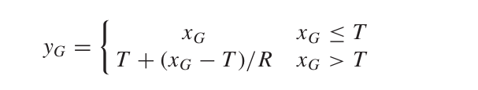

## Dynamic Range Compression (DRC)

In real-time audio or video conferencing, a sudden increase in the participant’s voice can degrade the perceptual audio quality. To maintain a consistent voice level during audio conferencing, it is necessary to attenuate the loud voices without causing additional artifacts. The Dynamic Range Compression algorithm accomplishes this goal by compressing the audio amplitudes where the decibel level exceeds a certain threshold. Amplitudes below this threshold are left unchanged which ensures a smooth transition of voice level.  

In DRC the following algorithm is used for compressing the high amplitudes of audio.

    

