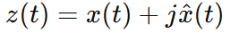
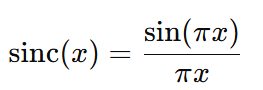

## Frequency Shifting

Audio signals are composed of sinusoids with different frequencies. In frequency shifting, the entire frequency spectrum of an audio signal is shifted upward or downward by a specified frequency shift amount. It is used in the Acoustic Feedback Loop Suppression problem. 

In the acoustic feedback loop, the sound that is played by the speaker is picked up by the microphone and reamplified again and again causing a loop. This feedback loop causes an annoying sound called howling. If it remains unhandled this howling sound can severely affect the voice quality. Frequency shifting disrupts the formation of this loop by shifting the frequencies up or down by a small amount.

## Frequency Shifting Process
1. At first the Hilbert Transformer is applied to the real-valued signal which creates a complex-valued analytical signal. The real part of the analytical signal contains the original signal and the imaginary part contains the Hilbert Transform of the original signal. The formula of the Hilbert Transform is provided below.

    

**Hilbert Transformation** 
* At first Fast Fourier Transformation (FFT) is applied to the original signal.
* Only positive frequencies are kept. The real and imaginary parts of the positive frequencies are multiplied by 2.
* Negative frequencies are zeroed out.
* Then the inverse FFT is applied.
* The resulting signal is called the analytical signal.

2. The analytical signal is multiplied by **e^i(2 * PI * fs * (t / f))** 
   Here, 
   * ``i`` = imaginary unit.
   * ``PI`` = 3.14159
   * **fs** = frequency shift amount
   * ``t`` = time
   * ``f`` = frequency
3. The above multiplication resulted in the shifted frequency spectrum by fs amount.
4. The real part of this signal is the final shifted version in the time domain.

## Observations
* When applying the frequency shifting on an audio chunk of duration 60ms (``960 samples``), some artifacts are added in the frequency-shifted audio.
* For audio chunks of duration multiples of 100ms (``1600 samples``), frequency shifting does not introduce any artifacts.
* As we process audio chunks of 60ms, at first using Sinc interpolation we generate 1600 samples from 960 samples.
* Then frequency shifting is applied to this interpolated signal and finally, the resulting signal is downsampled to 960 samples.

**Sinc Filter**
For resampling Sinc filter is used which has a maximum value of 1 at index 0 and decades gradually on both ends. The formula of the Sinc filter is provided below.

    

The below figure shows the shape of the Sinc filter. 

------------------------------------------------------------------------------------
For shifting frequency by a small amount, we use the Hilbert transformer.

## Resources
1. FREQUENCY SHIFTING FOR ACOUSTIC HOWLING SUPPRESSION (Paper - 2010)
      * https://ccrma.stanford.edu/~eberdahl/Papers/DAFx2010BerdahlHarris.pdf
      * https://ccrma.stanford.edu/~eberdahl/Projects/FreqShift/ (Demonstration - Stanford University)

2. 50 Years of Acoustic Feedback Control: State of the Art and Future Challenges (Paper - 2010)
      * https://ieeexplore.ieee.org/document/5675660 (Review paper on different methodologies for AFC)

## Finding
1. Frequency shifting works perfectly for processing time of multiples of 100ms.

2. For 60ms processing, a click sound is added after the chunks. To solve this problem, resampling is performed from 60ms to 100ms. After the frequency shifting, again resampling is performed from 100ms to 60ms using the Sinc interpolation technique, which yielded better results.
